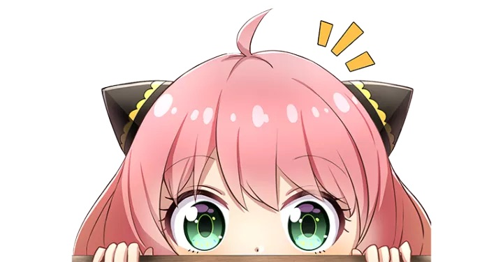

**(Get better view from Safari)**

## *Waku Waku*

> *About Yumeng:*

**Heyooo!** I am Yumeng Zhang, I am a computational biochemist. I currently work as a postdoc associate at [Prof. Zhang's Lab](https://zhanggroup.mit.edu/). My current research interest is to use machine-learning and Molecular dynamics simulations to understand the large scale biomolecular activities (like liquid-liquid phase separation.) 

I had my Ph.D. degree from University of Massachusetts Amherst on 2024 Feb. I was a grad student in [Prof. Chen's lab](https://people.chem.umass.edu/jchenlab/). (Many unforgettable and vivid  memories there! wow!)

I am still not 100% sure about the direction of my future career... But I am walking on the academic path towards science (for now, on 2024).

Life Yumeng is a father of two cats (Tricky and Twinkle), a lover of video games, and ACGer. 

## *Drude Drude*

> *About Yumeng's research*

**Multi-scale advanced sampling methods.**

>> 

> "See this powerful coarse-grained model!!." [Hyres](https://pubs.rsc.org/en/content/articlelanding/2017/cp/c7cp06736d), [HyRes II](https://pubs.acs.org/doi/abs/10.1021/acs.jcim.2c00974)

**Multi-scale simulations for biomolecules.**
>> <iframe width="933" height="525" src="https://www.youtube.com/embed/5FfRIcwVuv8" title="IDP_simulations_HyResII" frameborder="0" allow="accelerometer; autoplay; clipboard-write; encrypted-media; gyroscope; picture-in-picture; web-share" allowfullscreen></iframe>

> "See these biomolecular dynamics!!" 

**Liquid-liquid Phase separation**

>> 

>> <iframe width="716" height="525" src="https://www.youtube.com/embed/WAdvFVA7R0g" title="Liquid-liquid Phase Separation" frameborder="0" allow="accelerometer; autoplay; clipboard-write; encrypted-media; gyroscope; picture-in-picture; web-share" allowfullscreen></iframe>

> "See the dynamics of the membraneless organels (top) and biomolecular condensate (down)!" [LLPS](https://pubs.acs.org/doi/full/10.1021/jacs.3c09195)

**(To be continued...)**

## *Miaov Miaov*

> *Tricky & Twinkle*

Tricky came to me on 2019/11/01, the third month I came abroad for my Ph.D. study. She was called tricky since she missed the Halloween and I couldn't give her a treat. Twinkle was picked up on 2022/01/22. And she also becomes a light to shed tricky&my life in a very specific period. I so love my babies that they are really my treasure! Every moment in my life, they accompany with me, confort me, encourage me, and warm me. It's my biggest lucky to meet and live with them!! Miao~~

(Figures are extrally charged~) 

## *<<<Here They are!!>>>*

<iframe width="553" height="524" src="https://www.youtube.com/embed/iHgesAk_Sik" title="Tricky&Twinkle" frameborder="0" allow="accelerometer; autoplay; clipboard-write; encrypted-media; gyroscope; picture-in-picture" allowfullscreen></iframe>

***People enjoyed the video above, please pay by scanning the barcode below QwQ***

(Pretend to have a code)

## *Muk Muk*

Finally, again, it's so nice to meet you! I am also a game player that she enjoys bunches of games, especially **Metroidvania**. My favorite one is 'ori and the blind music', which has super super beautiful main theme music (as well as story). I also enjoy the animal crossing a lot! My favorite character is Fang lol, send all gifts to him~ 

-----------------------------

***"To all my friends, the night is young, the music is loud, then play our song!"***
