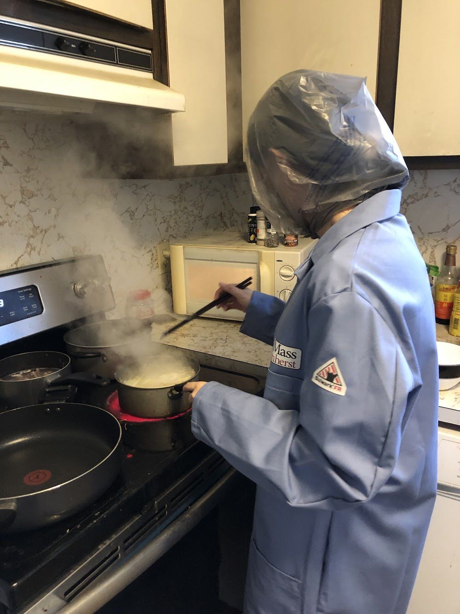

After three rotations, Yumeng successfully joined [Prof.Chen's lab](https://people.chem.umass.edu/jchenlab/)! 

The night receiving the confirmation email is indescribable. Yumeng did NOT do well in chemistry area in her undergrad period.

(<mark>An amateur Yumeng majored in chemistry QwQ</mark>)

She is thrilled in being accepted to join the group, and also doubted if she was qualified.

But she was so happy to start her new journey!

Years later, she thinks this is one of her best choice! (updated 07/14/2022)

(Will see years later later!)
